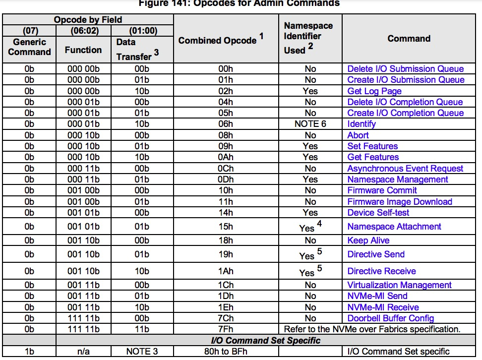
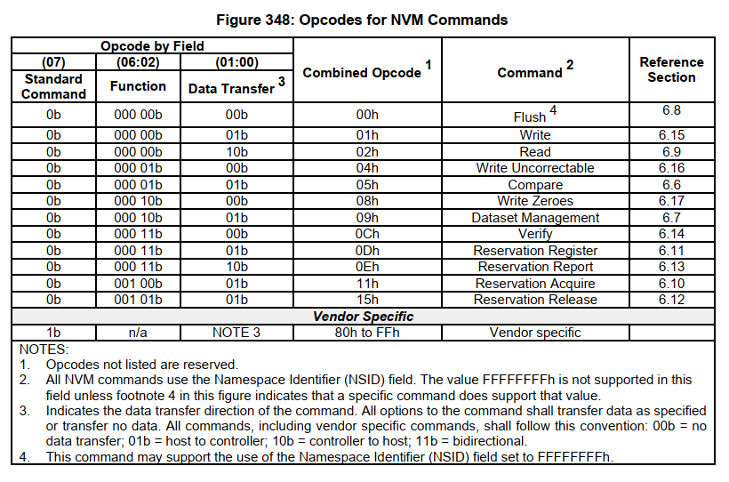
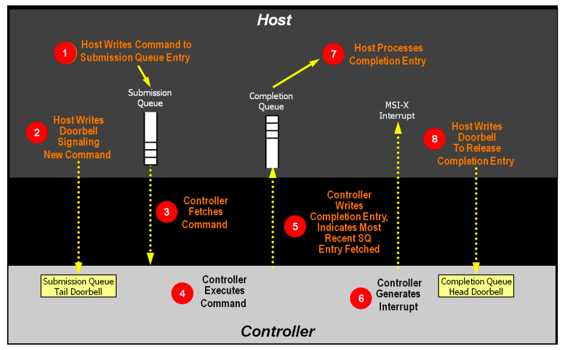

# 1. 写在前面

NVM Express协议（简称NVMe协议）在2007年被Intel提出，是一种以PCIe为基础，针对非易失内存的主机与子系统通信的协议，目前，已经逐步迭代更新至NVMe1.4。

本文以FEMU对nvme协议实现的源码为基础，展开对nvme工作原理的分析。

# 2. 相关协议的区别

传统机械硬盘和固态盘连接在SATA总线，使用的主机传输协议是[AHCI](https://zh.wikipedia.org/zh-cn/AHCI)协议，而现代告诉存储设备连接在PCIe总线，使用的主机传输协议是NVMe，他们的[区别](https://www.kingston.com/cn/community/articledetail/articleid/48543)是：
|AHCI|NVMe|
|-|-|
|针对旋转磁盘技术优化| 针对闪存固态盘优化|
|只有一个命令队列|多达64K命令队列|
|队列深度为32|队列深度为64K|
|高占用CPU|低占用CPU|
|延迟为6us|延迟为2.8us|
|必须与SATA控制器通信|直接与系统CPU通信|
|最大IOPS为10万|最大IOPS超过100万|

# 3. NVMe协议

NVMe协议在主机端和设备端均需做实现，在Linux+FEMU架构下，Linux实现主机端NVMe，而FEMU实现设备端NVMe。

Linux关于NVMe的源码位于`include/linux/nvme.h`和`drivers/nvme`，其中host表示当前系统作为主机与NVMe盘交互数据，target表示将当前系统封装成NVMe盘，与其他主机交互，target主要用于网络通信中。本文关注host目录源码。

FEMU关于NVMe的源码位于`hw/block/femu`。

## 3.1. 数据结构

### 3.1.1. 提交队列和完成队列

环形队列，尾指针指向队尾元素的下一个位置，头指针指向队首元素。I/O完成队列和I/O提交队列的最大槽位数是64Ki，并且由`CAP.MQES`指定。Admin提交队列和完成队列的最大槽位数是4Ki。

### 3.1.2. 提交队列项

命令大小64字节，格式如下：

|字节|描述|
|-|-|
|03:00|Command Dword0 (CWD0): 31-16位表示命令标识CID，15-14位表示用于传输数据的方式PSDT，PRP还是SGL，13-10**保留**，09-08组合操作FUSE，07-00操作码opcode|
|07:04|命令空间标识NSID|
|15:08|**保留**|
|23:16|元数据指针mptr,只有在命令有元数据，并且元数据没有与数据的逻辑块交织时有效，并且元数据的地址标识方式由`cdw0.psdt`决定|
|39:24|数据指针dptr|
|43:40|Command Dword10 (CWD10),在具体命令中被指定含义|
|47:44|Command Dword11 (CWD11),在具体命令中被指定含义|
|51:48|Command Dword12 (CWD12),在具体命令中被指定含义|
|55:42|Command Dword13 (CWD13),在具体命令中被指定含义|
|59:46|Command Dword14 (CWD14),在具体命令中被指定含义|
|63:60|Command Dword15 (CWD15),在具体命令中被指定含义|

FEMU的submmission queue entry的源码：

```c
typedef struct NvmeCmd {
    uint8_t     opcode;
    uint8_t     fuse;
    uint16_t    cid;
    uint32_t    nsid;
    uint64_t    res1;
    uint64_t    mptr;
    uint64_t    prp1;
    uint64_t    prp2;
    uint32_t    cdw10;
    uint32_t    cdw11;
    uint32_t    cdw12;
    uint32_t    cdw13;
    uint32_t    cdw14;
    uint32_t    cdw15;
} NvmeCmd;
```

### 3.1.3. 完成队列项

命令大小16字节，格式如下：

|字节|描述|
|-|-|
|15:12|DW0,在具体命令中被指定含义|
|11:08|DW1，**保留**|
|07:04|DW2,31-16位表示提交队列标识sqid,15-0位表示提交队列头指针sqhd|
|03:00|DW3,31-17位表示正在完成的命令的状态sf，16位表示表示完成队列是否是新的，完成队列是环形队列，每次走完一个环形时，Phase Tag被翻转，15-0位表示正在完成的命令的标识cid,一个请求队列一次最多未完成的命令个数是64Ki(队列深度)|

FEMU中completion queue entry的源码：

```c
typedef struct NvmeCqe {
    union {
        struct {
            uint32_t    result;
            uint32_t    rsvd;
        } n;
        uint64_t res64;
    };
    uint16_t    sq_head;
    uint16_t    sq_id;
    uint16_t    cid;
    uint16_t    status;
} NvmeCqe;
```

<u>DMA数据传输的地址是指物理地址，NVMe协议描述数据传输地址的方式提供两种：PRP和SGL，Admin命令只能使用PRP传输数据，而IO命令可以用PRP或者SGL传输数据，并且由`cwd0.pstd`指定。</u>

### 3.1.4. PRP和SGL

- PRP：由PRP1和PRP2表示传输的物理页地址，当传输的物理页无法有两个PRP表示，则PRP可以表示PRP Lists，并且每个指向的物理页的最后一个prp项指向下一个PRP Lists页。
- SGL：由于PRP只能表示一个个物理页，SGL能表示起始地址+长度，

## 3.2. Admin命令

Admin命令如下表所示：



### 3.2.1. 创建I/O完成队列命令

- prp1：如果`cdw11.pc=1`则表示完成队列64位基内存地址指针，且内存连续；如果`cdw11.pc=0`则表示prp list指针指向的内存页。
- cdw10:31-16位表示队列大小（QSIZE）,以0开始的值，15-0位表示队列标识QID.
- cdw11:31-16位表示中断向量（IV），对应着MSI-X中断，最多2048个中断被使用，15-2位表示**保留**,1位表示中断使能(IEN),0位表示物理连续（pc），如果完成队列连续，则prp1表示连续物理缓存的地址，若完成队列不联系，则prp1表示prp list指针。

FEMU中create I/O completion queue源码：

注：通过kvm虚拟化中断向量。

```c
uint16_t nvme_create_cq(FemuCtrl *n, NvmeCmd *cmd)
{
    NvmeCQueue *cq;
    NvmeCreateCq *c = (NvmeCreateCq *)cmd;
    uint16_t cqid = le16_to_cpu(c->cqid);
    uint16_t vector = le16_to_cpu(c->irq_vector);
    uint16_t qsize = le16_to_cpu(c->qsize);
    uint16_t qflags = le16_to_cpu(c->cq_flags);
    uint64_t prp1 = le64_to_cpu(c->prp1);
    int ret;

    if (!cqid || (cqid && !nvme_check_cqid(n, cqid))) {
        return NVME_INVALID_CQID | NVME_DNR;
    }
    if (!qsize || qsize > NVME_CAP_MQES(n->bar.cap)) {
        return NVME_MAX_QSIZE_EXCEEDED | NVME_DNR;
    }
    if (!prp1) {
        return NVME_INVALID_FIELD | NVME_DNR;
    }
    if (vector > n->num_io_queues) {
        return NVME_INVALID_IRQ_VECTOR | NVME_DNR;
    }
    if (!(NVME_CQ_FLAGS_PC(qflags)) && NVME_CAP_CQR(n->bar.cap)) {
        return NVME_INVALID_FIELD | NVME_DNR;
    }

    if (n->cq[cqid] != NULL) {
        nvme_free_cq(n->cq[cqid], n);
    }

    cq = g_malloc0(sizeof(*cq));
    assert(cq != NULL);
    if (nvme_init_cq(cq, n, prp1, cqid, vector, qsize + 1,
                NVME_CQ_FLAGS_IEN(qflags), NVME_CQ_FLAGS_PC(qflags))) {
        g_free(cq);
        return NVME_INVALID_FIELD | NVME_DNR;
    }

    if (cq->irq_enabled) {
        ret = nvme_add_kvm_msi_virq(n, cq);
        if (ret < 0) {
            error_report("nvme: add kvm msix virq failed\n");
            return -1;
        }

        ret = nvme_set_guest_notifier(n, &cq->guest_notifier, cq->cqid);
        if (ret < 0) {
            error_report("nvme: set guest notifier failed\n");
            return -1;
        }
    }

    if (cq->irq_enabled && !n->vector_poll_started) {
        n->vector_poll_started = true;
        if (msix_set_vector_notifiers(&n->parent_obj, nvme_vector_unmask,
                    nvme_vector_mask, nvme_vector_poll)) {
            error_report("nvme: msix_set_vector_notifiers failed\n");
            return -1;
        }
    }

    assert(cq->is_active == false);
    cq->is_active = true;

    return NVME_SUCCESS;
}

uint16_t nvme_init_cq(NvmeCQueue *cq, FemuCtrl *n, uint64_t dma_addr,
    uint16_t cqid, uint16_t vector, uint16_t size, uint16_t irq_enabled,
    int contig)
{
    cq->ctrl = n;
    cq->cqid = cqid;
    cq->size = size;
    cq->phase = 1;
    cq->irq_enabled = irq_enabled;
    cq->vector = vector;
    cq->head = cq->tail = 0;
    cq->phys_contig = contig;

    uint8_t stride = n->db_stride;
    int dbbuf_entry_sz = 1 << (2 + stride);
    AddressSpace *as = pci_get_address_space(&n->parent_obj);
    dma_addr_t cqsz = (dma_addr_t)size;

    if (cq->phys_contig) {
        cq->dma_addr = dma_addr;
        cq->dma_addr_hva = (uint64_t)dma_memory_map(as, dma_addr, &cqsz, 1);
    } else {
        cq->prp_list = nvme_setup_discontig(n, dma_addr, size,
                n->cqe_size);
        if (!cq->prp_list) {
            return NVME_INVALID_FIELD | NVME_DNR;
        }
    }

    QTAILQ_INIT(&cq->req_list);
    QTAILQ_INIT(&cq->sq_list);
    if (cqid && n->dbs_addr && n->eis_addr) {
        cq->db_addr = n->dbs_addr + (2 * cqid + 1) * dbbuf_entry_sz;
        cq->db_addr_hva = n->dbs_addr_hva + (2 * cqid + 1) * dbbuf_entry_sz;
        cq->eventidx_addr = n->eis_addr + (2 * cqid + 1) * dbbuf_entry_sz;
        cq->eventidx_addr_hva = n->eis_addr_hva + (2 * cqid + 1) * dbbuf_entry_sz;
        femu_debug("CQ, db_addr=%" PRIu64 ", eventidx_addr=%" PRIu64 "\n",
                cq->db_addr, cq->eventidx_addr);
    }
    msix_vector_use(&n->parent_obj, cq->vector);
    n->cq[cqid] = cq;

    return NVME_SUCCESS;
}
```

### 3.2.2. 创建I/O提交队列命令

各字段含义与I/O完成队列相同，不同是，cdw11的02-01位表示队列优先级（qprio）.

FEMU中Create I/O Completion Queue的源码：

1. 检查cqid,sqid,size,prp1等参数的合理性；
2. 初始化参数，并且根据优先级设置abr_burst。

```c
uint16_t nvme_init_sq(NvmeSQueue *sq, FemuCtrl *n, uint64_t dma_addr,
    uint16_t sqid, uint16_t cqid, uint16_t size, enum NvmeQueueFlags prio,
    int contig)
{
    uint8_t stride = n->db_stride;
    int dbbuf_entry_sz = 1 << (2 + stride);
    AddressSpace *as = pci_get_address_space(&n->parent_obj);
    dma_addr_t sqsz = (dma_addr_t)size;
    NvmeCQueue *cq;
    int i;

    sq->ctrl = n;
    sq->sqid = sqid;
    sq->size = size;
    sq->cqid = cqid;
    sq->head = sq->tail = 0;
    sq->phys_contig = contig;
    if (sq->phys_contig) {
        sq->dma_addr = dma_addr;
        sq->dma_addr_hva = (uint64_t)dma_memory_map(as, dma_addr, &sqsz, 0);
    } else {
        sq->prp_list = nvme_setup_discontig(n, dma_addr, size, n->sqe_size);
        if (!sq->prp_list) {
            return NVME_INVALID_FIELD | NVME_DNR;
        }
    }

    sq->io_req = g_malloc0(sq->size * sizeof(*sq->io_req));
    QTAILQ_INIT(&sq->req_list);
    QTAILQ_INIT(&sq->out_req_list);
    for (i = 0; i < sq->size; i++) {
        sq->io_req[i].sq = sq;
        QTAILQ_INSERT_TAIL(&(sq->req_list), &sq->io_req[i], entry);
    }

    switch (prio) {
    case NVME_Q_PRIO_URGENT:
        sq->arb_burst = (1 << NVME_ARB_AB(n->features.arbitration));
        break;
    case NVME_Q_PRIO_HIGH:
        sq->arb_burst = NVME_ARB_HPW(n->features.arbitration) + 1;
        break;
    case NVME_Q_PRIO_NORMAL:
        sq->arb_burst = NVME_ARB_MPW(n->features.arbitration) + 1;
        break;
    case NVME_Q_PRIO_LOW:
    default:
        sq->arb_burst = NVME_ARB_LPW(n->features.arbitration) + 1;
        break;
    }

    if (sqid && n->dbs_addr && n->eis_addr) {
        sq->db_addr = n->dbs_addr + 2 * sqid * dbbuf_entry_sz;
        sq->db_addr_hva = n->dbs_addr_hva + 2 * sqid * dbbuf_entry_sz;
        sq->eventidx_addr = n->eis_addr + 2 * sqid * dbbuf_entry_sz;
        sq->eventidx_addr = n->eis_addr_hva + 2 * sqid + dbbuf_entry_sz;
        femu_debug("SQ[%d],db=%" PRIu64 ",ei=%" PRIu64 "\n", sqid, sq->db_addr,
                sq->eventidx_addr);
    }

    assert(n->cq[cqid]);
    cq = n->cq[cqid];
    QTAILQ_INSERT_TAIL(&(cq->sq_list), sq, entry);
    n->sq[sqid] = sq;

    return NVME_SUCCESS;
}

uint16_t nvme_create_sq(FemuCtrl *n, NvmeCmd *cmd)
{
    NvmeSQueue *sq;
    NvmeCreateSq *c = (NvmeCreateSq *)cmd;

    uint16_t cqid = le16_to_cpu(c->cqid);
    uint16_t sqid = le16_to_cpu(c->sqid);
    uint16_t qsize = le16_to_cpu(c->qsize);
    uint16_t qflags = le16_to_cpu(c->sq_flags);
    uint64_t prp1 = le64_to_cpu(c->prp1);

    if (!cqid || nvme_check_cqid(n, cqid)) {
        return NVME_INVALID_CQID | NVME_DNR;
    }
    if (!sqid || (sqid && !nvme_check_sqid(n, sqid))) {
        return NVME_INVALID_QID | NVME_DNR;
    }
    if (!qsize || qsize > NVME_CAP_MQES(n->bar.cap)) {
        return NVME_MAX_QSIZE_EXCEEDED | NVME_DNR;
    }
    if (!prp1 || prp1 & (n->page_size - 1)) {
        return NVME_INVALID_FIELD | NVME_DNR;
    }
    if (!(NVME_SQ_FLAGS_PC(qflags)) && NVME_CAP_CQR(n->bar.cap)) {
        return NVME_INVALID_FIELD | NVME_DNR;
    }

    sq = g_malloc0(sizeof(*sq));
    if (nvme_init_sq(sq, n, prp1, sqid, cqid, qsize + 1,
                NVME_SQ_FLAGS_QPRIO(qflags),
                NVME_SQ_FLAGS_PC(qflags))) {
        g_free(sq);
        return NVME_INVALID_FIELD | NVME_DNR;
    }

    assert(sq->is_active == false);
    sq->is_active = true;

    return NVME_SUCCESS;
}
```

Admin命令中还有Get Log Page, Identify, NS mgnt., Get/Set Feature, Get LBA status.

## 3.3. IO命令
IO命令又称NVM命令，其命令操作码如下：



### 3.3.1. Flush命令

将易失性写缓存的数据持久化。

`Flush`命令的cdw10-cdw15全部被保留。

FEMU/nvme对`nvme_flush`未做实现。

### 3.3.2. Read命令

- 请求起始地址SLBA: 31-00位->cdw10 + 63-32位->cdw11
- cdw12: 31位表示是否重试读操作（LR）,30位表示读取数据是否提交至持久化介质，29-26位表示保护信息（PRINFO）指定保护信息的行为和检查变量，25-16位**保留**，15-0位表示逻辑块数量（NLB），从0开始计数。
- cdw13: 31-8位**保留**,7-0位表示数据集管理（DSM）描述被读的LBAs的属性，其中07位表示数据是否可压缩，06位表示请求是否顺序读，05-04位表示请求延迟，03-00位表示访问频率。
- cdw14: 逻辑块初始参考标记期望值（EILBRT）
- cdw15: 31-16位表示逻辑块应用标记掩码期望值（ELBATM）， 15-0位表示逻辑块应用标签（ELBAT）.

FEMU/nvme对读命令的实现：

1. 检查cmd,slba,nlb等参数合理性`femu_nvme_rw_check_req`；
2. prp1和prp2描述命令传输的数据，通过prp1和prp2获取DMA传输的数据块地址，当开启controller memory buffer时，由于主机可访问设备内存，因此数据可按照io vec传输`req->iov`，若未开启，则按照DMA scatter-gather方式传输`req->qsg`;
3. 在FEMU的后端内存读取数据`femu_rw_mem_backend_bb`。

```c
static uint16_t nvme_rw(FemuCtrl *n, NvmeNamespace *ns, NvmeCmd *cmd,
    NvmeRequest *req)
{
    NvmeRwCmd *rw = (NvmeRwCmd *)cmd;
    uint16_t ctrl = le16_to_cpu(rw->control);
    uint32_t nlb  = le16_to_cpu(rw->nlb) + 1;
    uint64_t slba = le64_to_cpu(rw->slba);
    uint64_t prp1 = le64_to_cpu(rw->prp1);
    uint64_t prp2 = le64_to_cpu(rw->prp2);
    const uint8_t lba_index = NVME_ID_NS_FLBAS_INDEX(ns->id_ns.flbas);
    const uint16_t ms = le16_to_cpu(ns->id_ns.lbaf[lba_index].ms);
    const uint8_t data_shift = ns->id_ns.lbaf[lba_index].ds;
    uint64_t data_size = (uint64_t)nlb << data_shift;
    uint64_t data_offset = slba << data_shift;
    uint64_t meta_size = nlb * ms;
    uint64_t elba = slba + nlb;
    uint16_t err;
    int ret;

    req->data_offset = data_offset;
    req->is_write = (rw->opcode == NVME_CMD_WRITE) ? 1 : 0;

    err = femu_nvme_rw_check_req(n, ns, cmd, req, slba, elba, nlb, ctrl, data_size,
            meta_size);
    if (err)
        return err;

    if (nvme_map_prp(&req->qsg, &req->iov, prp1, prp2, data_size, n)) {
        nvme_set_error_page(n, req->sq->sqid, cmd->cid, NVME_INVALID_FIELD,
                offsetof(NvmeRwCmd, prp1), 0, ns->id);
        return NVME_INVALID_FIELD | NVME_DNR;
    }

    assert((nlb << data_shift) == req->qsg.size);

    req->slba = slba;
    req->meta_size = 0;
    req->status = NVME_SUCCESS;
    req->nlb = nlb;
    req->ns = ns;

    ret = femu_rw_mem_backend_bb(&n->mbe, &req->qsg, data_offset, req->is_write);
    if (!ret) {
        return NVME_SUCCESS;
    }

    return NVME_DNR;
}
```

注：EILBRT,ELBATM,ELBAT，均在端到端保护信息中起作用。


### 3.3.3. Write 命令

写命令与读命令相同。

### 3.3.4. NVMe架构

命令处理流程如下图：

1. 主机将一个至多个执行命令放置在**内存**中下一个空闲提交队列槽位；
2. 主机用提交队列尾指针作为新值更新提交队列尾门铃寄存器，告知控制器有一个新的命令被提交，需要处理；
3. 控制器将提交队列槽位的命令传输至控制器，这里会用到仲裁机制，决定传输哪一个提交队列的命令；
4. 控制器（可能乱序）执行命令；
5. 命令执行完成后，控制器将完成队列项放置在与之关联的完成队列的空闲槽位，控制器会移动完成队列项中的提交队列头指针，告知主机最近一次被消耗的提交队列命令，Phase Tag会被反转，表明完成队列项是新的（这里的理解是，由于完成队列是环形队列，当环形队列由尾部工作至头部时，表明完成一个周期，而Phase Tag则表示完成队列项是否完成一个周期）；
6. 控制器**可能**会产生中断告知主机有一个新的完成队列项要处理；
7. 主机处理完成队列中的完成队列项（过程A），这里可能会做相应的错误处理，过程A持续直至遇到反转的Phase Tag终止（主机处理完成队列项会将同一周期内的处理完）；
8. 主机写完成队列头部门铃寄存器，表明完成队列项已经被处理。

FEMU/nvme命令提交源码（主要完成更新完成队列头部门铃寄存器sq_head_db，生成新的io命令`nvme_io_cmd`）：

```c
void nvme_process_sq_io(void *opaque, int index_poller)
{
    NvmeSQueue *sq = opaque;
    FemuCtrl *n = sq->ctrl;

    uint16_t status;
    hwaddr addr;
    NvmeCmd cmd;
    NvmeRequest *req;
    int processed = 0;

    nvme_update_sq_tail(sq);
    while (!(nvme_sq_empty(sq))) {
        if (sq->phys_contig) {
            addr = sq->dma_addr + sq->head * n->sqe_size;
            nvme_copy_cmd(&cmd, (void *)&(((NvmeCmd *)sq->dma_addr_hva)[sq->head]));
        } else {
            addr = nvme_discontig(sq->prp_list, sq->head, n->page_size,
                    n->sqe_size);
            femu_nvme_addr_read(n, addr, (void *)&cmd, sizeof(cmd));
        }
        nvme_inc_sq_head(sq);

        req = QTAILQ_FIRST(&sq->req_list);
        QTAILQ_REMOVE(&sq->req_list, req, entry);
        memset(&req->cqe, 0, sizeof(req->cqe));
        /* Coperd: record req->stime at earliest convenience */
        req->expire_time = req->stime = qemu_clock_get_ns(QEMU_CLOCK_REALTIME);
        req->cqe.cid = cmd.cid;

        if (n->print_log) {
            femu_debug("%s,cid:%d\n", __func__, cmd.cid);
        }

        /* Coperd: For TIFA */
        req->tifa_cmd_flag = ((NvmeRwCmd *)&cmd)->rsvd2;

        status = nvme_io_cmd(n, &cmd, req);
        printf("nvme opcode: %lu, req slba: %lu, req nlb: %lu\n", 
                (uint64_t)cmd.opcode,
                (uint64_t)req->slba,
                (uint64_t)req->nlb);

        if (1 || status == NVME_SUCCESS) {
            req->status = status;

            int rc = femu_ring_enqueue(n->to_ftl[index_poller], (void *)&req, 1);
            if (rc != 1) {
                femu_err("enqueue failed, ret=%d\n", rc);
            }
        } else {
            femu_err("Error IO processed!\n");
        }

        processed++;
    }

    nvme_update_sq_eventidx(sq);
    sq->completed += processed;
}
```

FEMU/nvme命令完成源码（主要更新完成队列尾部命令寄存器（cq_tail_db）和执行中断服务例程（isr））：

```c
static void nvme_post_cqe(NvmeCQueue *cq, NvmeRequest *req)
{
    FemuCtrl *n = cq->ctrl;
    NvmeSQueue *sq = req->sq;
    NvmeCqe *cqe = &req->cqe;
    uint8_t phase = cq->phase;
    hwaddr addr;


    cqe->res64 = req->gcrt;

    if (n->print_log) {
        femu_debug("%s,req,lba:%lu,lat:%lu\n", n->devname, req->slba, req->reqlat);
    }

    if (!req->is_write && req->tifa_cmd_flag == 911 && n->print_log)
        femu_debug("%s,GCT,cqe->res64=%lu\n", n->devname, cqe->res64);
    if (req->gcrt) {
        /* Coperd: For TIFA, force error back to host */
        req->status = NVME_DNR;
        cqe->status = cpu_to_le16((req->status << 1) | phase);
    } else {
        cqe->status = cpu_to_le16((req->status << 1) | phase);
    }
    cqe->sq_id = cpu_to_le16(sq->sqid);
    cqe->sq_head = cpu_to_le16(sq->head);

    if (cq->phys_contig) {
        addr = cq->dma_addr + cq->tail * n->cqe_size;
        ((NvmeCqe *)cq->dma_addr_hva)[cq->tail] = *cqe;
    } else {
        addr = nvme_discontig(cq->prp_list, cq->tail, n->page_size, n->cqe_size);
        femu_nvme_addr_write(n, addr, (void *)cqe, sizeof(*cqe));
    }

    nvme_inc_cq_tail(cq);
}

static void nvme_process_cq_cpl(void *arg, int index_poller)
{
    FemuCtrl *n = (FemuCtrl *)arg;
    NvmeCQueue *cq = NULL;
    NvmeRequest *req = NULL;
    struct rte_ring *rp = n->to_ftl[index_poller];
    pqueue_t *pq = n->pq[index_poller];
    uint64_t now;
    int processed = 0;
    int rc;
    int i;

    if (n->femu_mode == FEMU_BLACKBOX_MODE) {
        rp = n->to_poller[index_poller];
    }

    while (femu_ring_count(rp)) {
        req = NULL;
        rc = femu_ring_dequeue(rp, (void *)&req, 1);
        if (rc != 1) {
            femu_err("dequeue from to_poller request failed\n");
        }
        assert(req);

        pqueue_insert(pq, req);
    }

    while ((req = pqueue_peek(pq))) {
        now = qemu_clock_get_ns(QEMU_CLOCK_REALTIME);
        if (now < req->expire_time) {
            break;
        }

        cq = n->cq[req->sq->sqid];
        if (!cq->is_active)
            continue;
        nvme_post_cqe(cq, req);
        QTAILQ_INSERT_TAIL(&req->sq->req_list, req, entry);
        pqueue_pop(pq);
        processed++;
        n->nr_tt_ios++;
        if (now - req->expire_time >= 20000) {
            n->nr_tt_late_ios++;
            if (n->print_log) {
                femu_debug("%s,diff,pq.count=%lu,%" PRId64 ", %lu/%lu\n",
                        n->devname, pqueue_size(pq), now - req->expire_time,
                        n->nr_tt_late_ios, n->nr_tt_ios);
            }
        }
        n->should_isr[req->sq->sqid] = true;
    }

    if (processed == 0)
        return;

    switch (n->multipoller_enabled) {
        case 1:
            nvme_isr_notify_io(n->cq[index_poller]);
            break;

        default:
            for (i = 1; i <= n->num_io_queues; i++) {
                if (n->should_isr[i]) {
                    nvme_isr_notify_io(n->cq[i]);
                    n->should_isr[i] = false;
                }
            }
            break;
    }
}
```



# FEMU仿真器架构

FEMU是一个以[QEMU](https://www.qemu.org/)为基础，模拟以闪存为介质的固态盘仿真器，提供3种仿真盘：no ssd, blackblock ssd（主机不知道盘的细节）和whiteblock ssd（向主机暴露盘的细节，已经实现的模拟盘有[ocssd](https://openchannelssd.readthedocs.io/en/latest/specification/)和[zns-ssd](https://zonedstorage.io/introduction/zns/)）。

FEMU架构如下图，下面从三个方面分析FEMU架构：


## QEMU的进程和线程与宿主机的进程和线程的关系

在Guest OS中运行`top`观察到的CPU核数与宿主机核数一致，这说明虚拟机可利用宿主机所有核（i.e.,宿主机的所有CPU资源可被单个QEMU进程使用，不存在资源浪费问题）。

每个虚拟机启动一个QEMU进程`qemu-system-x86_64`，每个虚拟机会启动多个线程，分别分配给Guest OS的虚拟核vCPU，模仿核的工作，QEMU进程创建的主要线程有：

- 一个主线程
- 多个vCPU核线程
- 多个I/O线程
- work thread等等，比如vnc server, nvme poller, ftl poller等

## FEMU的数据与逻辑地址分离处理

FEMU在仿真固态盘时，将真实数据写入内存，将逻辑地址单独处理，这里涉及两个线程nvme_poller和ftl_poller，并且以环形队列管理请求，源码如下：

```c
nvme_process_sq_io
    nvme_io_cmd  ->  
        nvme_rw(n, ns, cmd, req)
            femu_rw_mem_backend_bb  // 解析prp以DMA的SGL方式将真实数据写至内存和从内存读取数据
    femu_ring_enqueue(n->to_ftl[index_poller], (void *)&req, 1); // 将nvme_rw中获取的slba和len作为请求的起始地址和长度参与FTL的仿真
```

## FEMU时延模拟

FEMU在FTL中利用时间线推进模拟时延（i.e.,没有真正的物理时延），源码：

```c
static uint64_t ssd_advance_status(struct ssd *ssd, struct ppa *ppa,
        struct nand_cmd *ncmd)
{
    int c = ncmd->cmd;
    uint64_t cmd_stime = (ncmd->stime == 0) ? \
        qemu_clock_get_ns(QEMU_CLOCK_REALTIME) : ncmd->stime;
    uint64_t nand_stime;
    struct ssdparams *spp = &ssd->sp;
    //struct ssd_channel *ch = get_ch(ssd, ppa);
    struct nand_lun *lun = get_lun(ssd, ppa);
    uint64_t lat = 0;

    switch (c) {
    case NAND_READ:
        /* read: perform NAND cmd first */
        nand_stime = (lun->next_lun_avail_time < cmd_stime) ? cmd_stime : \
                     lun->next_lun_avail_time;
        lun->next_lun_avail_time = nand_stime + spp->pg_rd_lat;
        lat = lun->next_lun_avail_time - cmd_stime;
#if 0
        lun->next_lun_avail_time = nand_stime + spp->pg_rd_lat;

        /* read: then data transfer through channel */
        chnl_stime = (ch->next_ch_avail_time < lun->next_lun_avail_time) ? \
            lun->next_lun_avail_time : ch->next_ch_avail_time;
        ch->next_ch_avail_time = chnl_stime + spp->ch_xfer_lat;

        lat = ch->next_ch_avail_time - cmd_stime;
#endif
        break;

    case NAND_WRITE:
        /* write: transfer data through channel first */
        nand_stime = (lun->next_lun_avail_time < cmd_stime) ? cmd_stime : \
                     lun->next_lun_avail_time;
        if (ncmd->type == USER_IO) {
            lun->next_lun_avail_time = nand_stime + spp->pg_wr_lat;
        } else {
            lun->next_lun_avail_time = nand_stime + spp->pg_wr_lat;
        }
        lat = lun->next_lun_avail_time - cmd_stime;

#if 0
        chnl_stime = (ch->next_ch_avail_time < cmd_stime) ? cmd_stime : \
                     ch->next_ch_avail_time;
        ch->next_ch_avail_time = chnl_stime + spp->ch_xfer_lat;

        /* write: then do NAND program */
        nand_stime = (lun->next_lun_avail_time < ch->next_ch_avail_time) ? \
            ch->next_ch_avail_time : lun->next_lun_avail_time;
        lun->next_lun_avail_time = nand_stime + spp->pg_wr_lat;

        lat = lun->next_lun_avail_time - cmd_stime;
#endif
        break;

    case NAND_ERASE:
        /* erase: only need to advance NAND status */

        nand_stime = (lun->next_lun_avail_time < cmd_stime) ? cmd_stime : \
                     lun->next_lun_avail_time;
        lun->next_lun_avail_time = nand_stime + spp->blk_er_lat;

        lat = lun->next_lun_avail_time - cmd_stime;
        break;

    default:
        printf("Unsupported NAND command: 0x%x\n", c);
    }

    return lat;
}
```

在FTL poller线程中奖延迟lat交给`req->lat`，并且累计`req->expire_time`,`req->expire_time`才真正涉及到真实的物理时延仿真，可理解成请求的消失时间戳，与系统时间关联。


```c
static void *ftl_thread(void *arg)
{
    FemuCtrl *n = (FemuCtrl *)arg;
    struct ssd *ssd = &n->ssd;
    NvmeRequest *req = NULL;
    uint64_t lat = 0;
    int rc;

    while (!*(ssd->dataplane_started_ptr)) {
        usleep(100000);
    }
    // return;

    while (1) {
        for (int i = 1; i <= n->num_poller; i++) {
            if (!ssd->to_ftl[i] || !femu_ring_count(ssd->to_ftl[i]))
                continue;

            rc = femu_ring_dequeue(ssd->to_ftl[i], (void *)&req, 1);
            if (rc != 1) {
                printf("FEMU: FTL to_ftl dequeue failed\n");
            }
            assert(req);
            switch (req->is_write) {
                case 1:
                    lat = ssd_write(ssd, req);
                    break;
                case 0:
                    lat = ssd_read(ssd, req);
#if 0
                if (lat >= 20000000) {
                    lat /= 4;
                }
#endif
                    break;
                default:
                    printf("FEMU: FTL received unkown request type, ERROR\n");
            }

            req->reqlat = lat;
            req->expire_time += lat;

            rc = femu_ring_enqueue(ssd->to_poller[i], (void *)&req, 1);
            if (rc != 1) {
                printf("FEMU: FTL to_poller enqueue failed\n");
            }

            /* clean one line if needed (in the background) */
            if (should_gc(ssd)) {
                do_gc(ssd, false);
            }
        }
    }
}
```

FEMU通过真实时间消耗，模拟系统的时延推进，原理是：req在nvme命令处理完毕时，从`to_ftl`队列中推入pqueue队列（优先级队列pq），在队列pq中扫描，找到`req->expire_time`超过真实系统时间`QEMU_CLOCK_REALTIME`，则请求时延模拟完毕，请求会被再次添加提交队列。

```c
ftl_thread:
    femu_ring_dequeue(ssd->to_ftl.., &req..)
    femu_ring_enqueue(ssd->to_poller.., &req...)

nvme_process_cq_cpl:
    femu_ring_dequeue(n->to_ftl.., &req...)
    ...
    pqueue_peek
    now <- qemu_clock_get_ns(QEMU_CLOCK_REALTIME)
    if (now < req->expire_time) break;
    ...
```

# 4. 相关资料

- [NVM-Express-1_4b-2020.09.21-Ratified.pdf](https://nvmexpress.org/wp-content/uploads/NVM-Express-1_4b-2020.09.21-Ratified.pdf)
- https://zhuanlan.zhihu.com/p/72484589
- https://blog.csdn.net/defeattroy/article/details/9000398

# 5. 附录：
## 5.1. [scatter-gather DMA](https://my.oschina.net/u/174242/blog/72918)

DMA传输使用的是物理地址，并且要求源物理地址和目的物理地址均连续。

DMA传输有两种：block DMA和scatter-gather DMA，block DMA将一个物理连续的数据传输完毕后， 触发中断告知主机传输下一个物理连续的数据，scatter-gather DMA以链表方式管理多个物理连续的数据块，只需将链表首地址告知DMA master，将多个物理不连续的数据块传输完毕后发起一次中断。