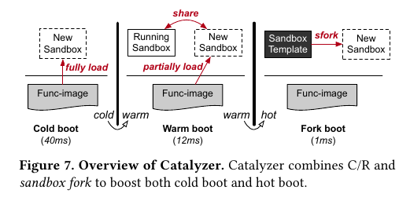

# Catalyzer: Sub-millisecond Startup for Serverless Computing with Initialization-less Booting

[论文PDF下载链接](https://ipads.se.sjtu.edu.cn/_media/publications/duasplos20.pdf)

## 1. 背景介绍

无服务器运算（Serverless computing）是云计算的一种模型，终端客户不需要部署、配置或管理服务器服务，只需要向平台提交需要运行的代码 (handler function)，代码运行所需要的服务器服务皆由云端平台来提供。无服务器运算使用sandbox技术，即container或VM. 这些技术的挑战在于，服务启动的时间比较长；尽管sandbox本身在优化后可以缩短启动时间，但handler function本身的加载时间没有得到优化（例如Java的JVM和Python解释器），本文以其中一种沙盒gVisor为例，解决此问题。

## 2. gVisor启动过程分析

gVisor启动时首先进行准备工作，分为四项操作：

- 解析配置文件：读取对沙盒的配置
- 分配虚拟化资源：如VCPU和内存分配
- 挂载根文件系统（root file system, rootfs）
- 初始化guest kernel

这些准备工作按下图的顺序进行（以Java应用为例）：

图中，Restore路线为从保存的状态恢复时执行的路线，Reconnect IO操作为将保存的文件描述符对应的文件重新打开。

## 3. Catalyzer的解决方案

Catalyzer基于Checkpoint/Restore(C/R)的思想解决问题。所谓C/R，是指将沙盒启动后，保存内存中的系统状态(checkpoint)，并在下次启动时恢复(restore)。

Catalyzer有三种工作方式，见下图：Cold boot, 即C/R方式中的Restore, 将硬盘中保存的状态装入内存；Warm boot, 即共享现有的已经在运行的沙盒实例中的部分内存，避免一部分内存复制，但由于要实现沙盒之间的隔离，文件需要重新打开；Fork boot, 即通过定义的新系统调用sfork, sandbox fork, 配合Overlay RootFS, 进一步优化性能。

### 3.1 Overlay Memory

在cold boot阶段，从容器映像生成的页表称为Base-EPT；在warm boot时，首先共享原实例的Base-EPT，接着通过copy on write(CoW)方式形成新实例的私有页表Private-EPT。

### 3.2 Separated State Recovery

传统 C/R 方式在生成映像时将系统元数据（如：线程和计时器）序列化并存入映像，并在恢复时将系统元数据反序列化；这样实现带来的性能问题在于，反序列化作为沙盒启动过程的一部分，具有较大的开销。

Catalyzer提出，将反序列化过程作为线下准备阶段从启动过程中解耦，也就是将反序列化的结果保存在映像中。反序列化的结果分为两部分：对于离散的部分，可以直接加载进内存中；对于相互关联的部分（例如指针），维护一个关系表，采用类似重定位的方法，在加载进内存后，恢复这些指针的值。

通过这种方法，Catalyzer 将反序列化的时间开销转移到了线下。

### 3.3 按需IO重连

C/R 方法在恢复阶段要根据持有的文件描述符重新打开文件。然而，统计表明，许多文件资源在初始化完成后便很少用到。根据这个事实，Catalyzer实现了按需恢复文件打开状态。Catalyzer将文件描述符标记为“尚未恢复”，仅当实际需要读取该文件时，才恢复打开状态。

### 3.4 Sandbox Fork

为了实现性能最好的fork boot, Catalyzer提出构建通用的模板沙盒，并使用模板沙盒生成新的沙盒实例。与warm boot不同的是，fork boot不希望重新打开一遍文件，而是希望利用模板沙盒的文件，但同时保持文件系统的独立性。同时，Fork boot希望使用类似fork的方法得到沙盒实例，因此要解决多线程问题，因为fork时会丢失线程信息。

Sfork 的基本示意图如图。

#### 3.4.1 OverlayFS

为了复用已经打开的文件，可以使用clone()从模板沙盒的进程得到沙盒实例的进程，同时指定继承模板沙盒进程的文件描述符。这样虽然避免了重复打开文件，但是将不允许再进行写操作，因为这将破坏模板沙盒的文件内容。取而代之的是，将写操作记录在内存中，也就是用内存实现overlay filesystem. 

#### 3.4.2 多线程fork

fork系统调用无法保存多线程上下文，Catalyzer将多线程在sfork前停止，将其状态打包为一个线程，在sfork后将这个线程恢复为多线程。

## 4. 总结

Catalyzer带给我们的启发有：

- 将内核CoW的机制外延；文章据此实现overlay filesystem这样的复合磁盘和内存的文件系统
- “按需”是这篇文章的出发点，几乎所有设计都与"lazy"概念挂钩。
