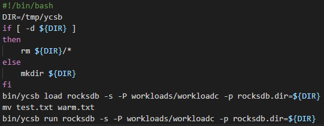

[代码下载链接](https://github.com/has-lab/YCSB-tracegen)

## 0. Quick Start

- \# 需要自行下载安装java及maven
- cd ~
- git clone git@github.com:has-lab/YCSB-tracegen.git
- cd YCSB-tracegen
- mvn -pl site.ycsb:rocksdb-binding -am clean package
- ./ycsb.sh

生成的trace文件包含两个：`YCSB-tracegen/warm.txt`（load阶段预先插入的KV）和`YCSB-tracegen/test.txt`（run阶段的访问模式）。

## 1. 代码修改

所修改的文件为`YCSB-tracegen/rocksdb/src/main/java/site/ycsb/db/rocksdb/RocksDBClient.java`。

以Insert为例：

添加的代码如上图。打开或创建名为test.txt的文件，通过FileWriter对象将Insert标识"I"、key以及value写入该文件中。

其他操作类似，现有能够保留到trace文件的操作包括insert、read、update、delete。

## 2. 运行脚本

运行YCSB需要load和run两阶段，前一阶段全部是插入操作，后一阶段根据负载决定访问模式。

可以将两次运行的指令写到脚本文件中，方便执行。示例如下：

使用的负载为workloadc，可以在`YCSB-tracegen/workloads/workloadc`文件中修改其参数设置，也可以自行编写一个workload文件，并在运行YCSB时用-P指定。

参数设置可参考[YCSB官方文档中译](http://lsr1991.github.io/2015/04/26/ycsb-document-translation-core-properties/)、[YCSB workload工作负载参数设置](https://blog.csdn.net/clever_wr/article/details/88992723)等文档。

[返回博客列表](https://haslab.org/blog/)